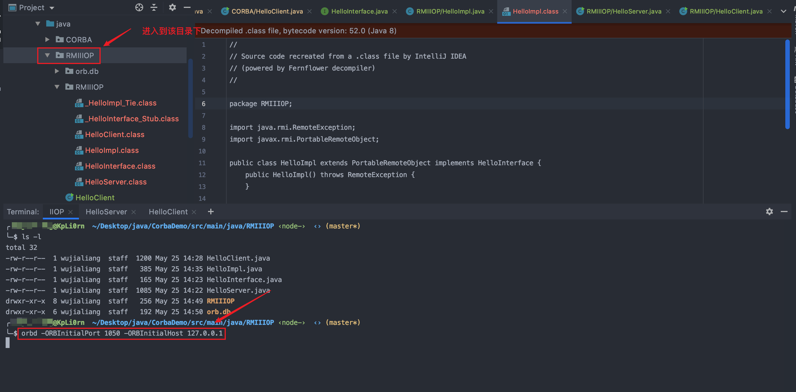
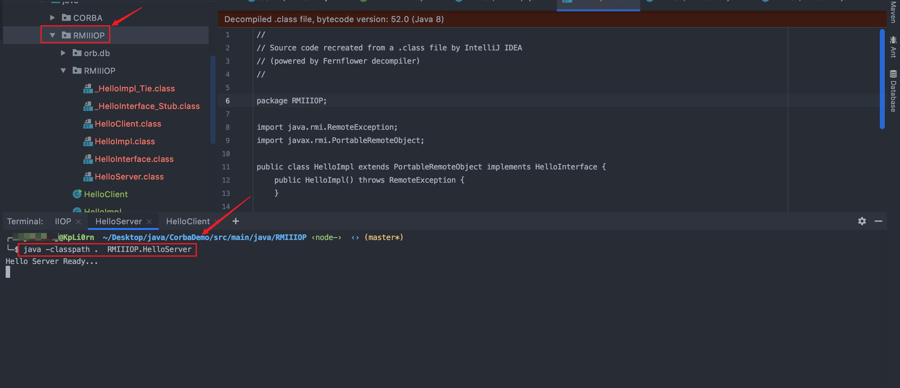
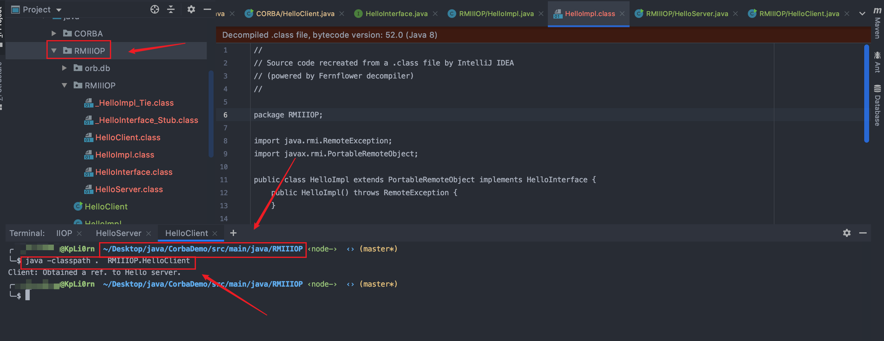
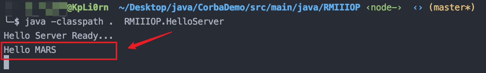

# CORBADemo
文章：（还在写ing

## CORBA DEMO 来源：https://www.secpulse.com/archives/139999.html

`orbd -ORBInitialPort 1050 -ORBInitialHost 127.0.0.1`

进入到 CORBA 目录下依次执行 HelloServer 和 HelloClient 

## RMI-IIOP DEMO 来源：https://xz.aliyun.com/t/7422#toc-6
执行
`orbd -ORBInitialPort 1050 -ORBInitialHost 127.0.0.1`

进入到 RMIIIOP 目录下执行 

`java -classpath .  RMIIIOP.HelloServer`

在当前目录下执行 

`java -classpath .  RMIIIOP.HelloClient`

